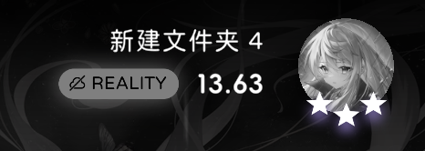
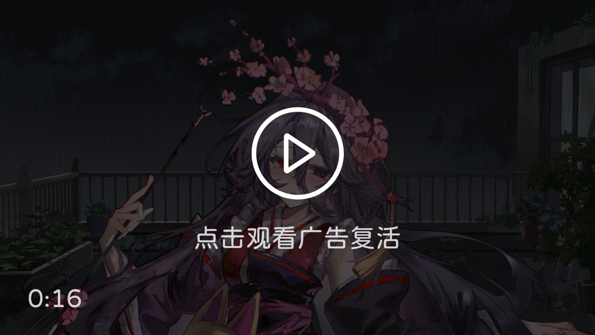
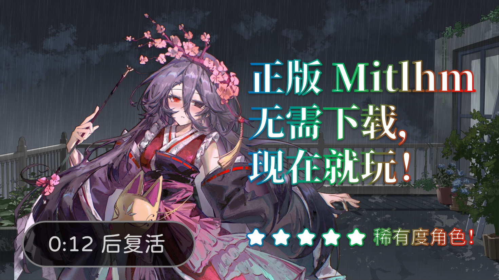
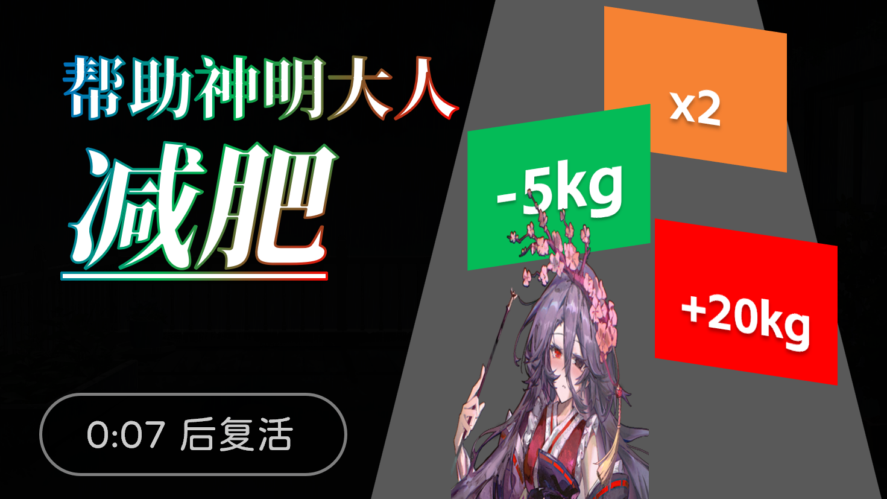
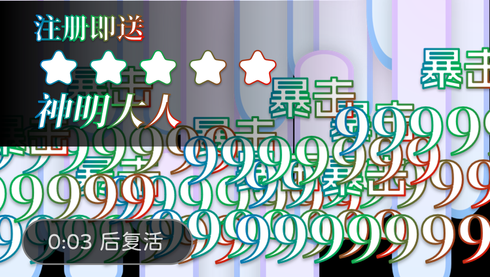
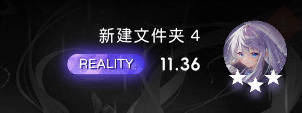

<ChatBubble role="user" avatar="/story/files/raingpt/me.png">

</ChatBubble>

<ChatBubble role="user" avatar="/story/files/raingpt/me.png">
我好像有一点死了。
</ChatBubble>

<ChatBubble role="bot" avatar="/story/files/raingpt/raingpt.png">
现在还有复活的风险吗？
</ChatBubble>

<ChatBubble role="user" avatar="/story/files/raingpt/me.png">
何意味
</ChatBubble>

<ChatBubble role="bot" avatar="/story/files/raingpt/raingpt.png">
这是最新的“在线 Reality”功能。 当你未登录时，头像会显示为灰色，此时显示的Reality是按本地成绩计算的。
</ChatBubble>

<ChatBubble role="user" avatar="/story/files/raingpt/me.png">
那怎么复活
</ChatBubble>

<ChatBubble role="bot" avatar="/story/files/raingpt/raingpt.png">

</ChatBubble>

<ChatBubble role="bot" avatar="/story/files/raingpt/raingpt.png">

</ChatBubble>

<ChatBubble role="bot" avatar="/story/files/raingpt/raingpt.png">

</ChatBubble>

<ChatBubble role="bot" avatar="/story/files/raingpt/raingpt.png">

</ChatBubble>

<ChatBubble role="bot" avatar="/story/files/raingpt/raingpt.png">
恭喜您复活成功！
</ChatBubble>

<ChatBubble role="bot" avatar="/story/files/raingpt/raingpt.png">

</ChatBubble>

<ChatBubble role="user" avatar="/story/files/raingpt/me.png">
干嘛……
</ChatBubble>

<ChatBubble role="user" avatar="/story/files/raingpt/me.png">
我的 Reality 怎么还变低了……
</ChatBubble>

<ChatBubble role="bot" avatar="/story/files/raingpt/raingpt.png">
当你登录 Milkloud 后，将会启用“在线Reality”功能。 该Reality仅统计您在登陆状态、且联机的情况下结算的成绩哦！
</ChatBubble>

<ChatBubble role="user" avatar="/story/files/raingpt/me.png">
登录后，结算不会显示我涨了多少Reality诶。
</ChatBubble>

<ChatBubble role="bot" avatar="/story/files/raingpt/raingpt.png">
当前服务器资源紧张，在您结算后的一段时间，在线Reality会自动更新~
</ChatBubble>
