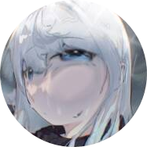

<ChatBubble role="user" avatar="/story/files/raingpt/me.png">
右边的“❤”是什么？
</ChatBubble>

<ChatBubble role="bot" avatar="/story/files/raingpt/raingpt.png">
是已收藏的对话记录哦。
</ChatBubble>

<ChatBubble role="user" avatar="/story/files/raingpt/me.png">
我不记得我收藏过这些对话……
</ChatBubble>

<ChatBubble role="bot" avatar="/story/files/raingpt/raingpt.png">
您误会了。 那不是您的收藏夹，是我的收藏夹。
</ChatBubble>

<ChatBubble role="user" avatar="/story/files/raingpt/me.png">

</ChatBubble>
